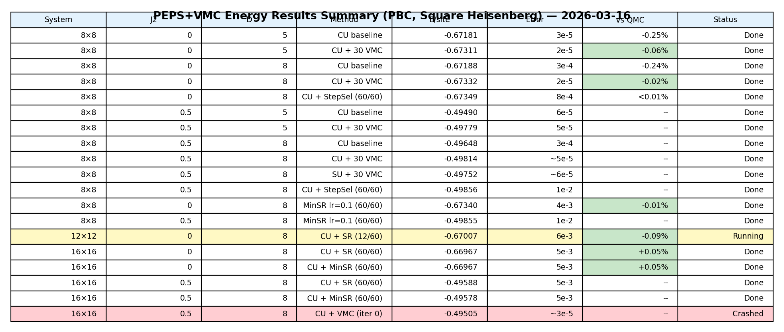

# PEPS+VMC Results: Square Heisenberg (PBC, SR Optimizer)

**Date:** 2026-03-07 (updated)
**Status:** 6 completed runs, 2 running jobs, 2 resubmitted (16x16 J2=0, 12x12), 1 failed (16x16 J2=0.5)
**Method:** Finite PEPS + VMC optimization with Stochastic Reconfiguration (SR)
**Boundary condition:** Periodic (PBC), TRG contraction

### Initial state sources

All VMC runs use **Yubin's cluster-update (CU) tensors** (2x2 unit cell) as the initial PEPS state, unless otherwise noted. The only exception is the 8x8 J2=0.5 D=8 SU→VMC run, which starts from **our own simple-update (SU) state**.

---

## 1. Summary of Results

### Key numbers

| System | J2 | D | Method | E/site | Error | vs QMC | Status |
|--------|-----|---|--------|---------|-------|--------|--------|
| 8x8 | 0 | 5 | CU baseline | -0.67181 | 3e-5 | -0.25% | Done |
| 8x8 | 0 | 5 | CU + 30 VMC | **-0.67311** | 2e-5 | **-0.06%** | Done |
| 8x8 | 0 | 8 | CU baseline | -0.67188 | 3e-4 | -0.24% | Done |
| 8x8 | 0 | 8 | CU + 30 VMC | **-0.67332** | 2e-5 | **-0.02%** | Done |
| 8x8 | 0 | 8 | CU + StepSel 60-iter (6/60) | -0.67313 | 2e-4 | -0.05% | Running |
| 8x8 | 0.5 | 5 | CU baseline | -0.49490 | 6e-5 | -- | Done |
| 8x8 | 0.5 | 5 | CU + 30 VMC | **-0.49779** | 5e-5 | -- | Done |
| 8x8 | 0.5 | 8 | CU baseline | -0.49648 | 3e-4 | -- | Done |
| 8x8 | 0.5 | 8 | CU + VMC (30/30) | **-0.49814** | ~5e-5 | -- | Done |
| 8x8 | 0.5 | 8 | SU + VMC (30/30) | **-0.49752** | ~6e-5 | -- | Done |
| 12x12 | 0 | 8 | CU + VMC | -- | -- | -- | **Resubmitted** |
| 16x16 | 0 | 8 | CU + VMC (iter 0) | -0.66934 | ~3e-5 | -0.09% | **Resubmitted** |
| 16x16 | 0.5 | 8 | CU + VMC (iter 0) | -0.49505 | ~3e-5 | -- | **FAILED** |

- **CU** = cluster-update initial state (Yubin's 2x2 unit cell tensors)
- **QMC** benchmarks: L=8 (-0.673487), L=12 (-0.670685), L=16 (-0.669976) [J2=0 only]
- **vs QMC** = (E_PEPS - E_QMC) / |E_QMC| as percentage

---

## 2. J2 = 0 (Pure Heisenberg): VMC Convergence

> **Initial state:** Yubin's cluster-update tensors (2x2 unit cell, tiled to 8x8)

### Observations

- **D=8 reaches lower energy than D=5**, confirming the benefit of larger bond dimension.
  - D=5 final: E/site = -0.67311 (0.06% above QMC)
  - D=8 final: E/site = -0.67332 (0.02% above QMC)
- Both trajectories converge smoothly with no spikes. Gradient norm decreases steadily.
- **D=8 converges faster** in the first 10 iterations (steeper slope), consistent with having more variational parameters.
- After 30 iterations, both are still slowly improving — the new 60-iter stepselector run will test whether further iterations help.

### D=5 vs D=8 overlay

- D=8 final measured energy (-0.67332) is within **0.02%** of QMC (-0.673487).
- The D=5→D=8 improvement from VMC (+0.00021 in E/site) is modest but systematic.
- CU baselines for D=5 and D=8 are nearly identical (-0.67181 vs -0.67188), confirming that **VMC optimization is essential** — increasing D alone without VMC gains almost nothing.

### InitialStepSelector run (new, job 525891)

> **Initial state:** Fresh from Yubin CU tensors; 60 iterations planned

- At iter 0, the selector probed multiple learning rates and chose **lr = 0.3** (vs the default 0.1 used in the 30-iter run). This selection took ~7.2 hours (vs ~2.4 hr/iter for normal iters).
- Despite the higher lr, **convergence is stable** — no spikes, gradient norm decreasing smoothly.
- After only 5 iters, energy is already at -0.67313 (E/site), approaching the 30-iter run's final value of -0.67332. The stepselector accelerates early convergence.
- The stepselector does not trigger again after iter 0 (`selector_triggered: false` for iters 1–5).

---

## 3. J2 = 0.5 (Frustrated Heisenberg): VMC Convergence

> **Initial state:** Yubin's cluster-update tensors for D=5 and D=8 CU→VMC curves.
> The D=8 SU→VMC curve (orange) uses **our own simple-update state** as initial state.

### Observations

- **D=5 completed 30 iterations** (Yubin CU→VMC): E/site drops from -0.49490 (CU) to -0.49779, a **0.58% improvement**.
- **D=8 CU→VMC completed 30 iters** (E/site = -0.49814): Surpassed D=5 final value. Job 524096 completed after 5d 4h.
- **D=8 SU→VMC completed 30 iters** (E/site = -0.49752): Job 524679 completed after 4d 21h. Both converged to a similar region, confirming VMC is largely independent of the initial state after ~20 iters.
- J2=0.5 shows larger VMC improvement (+0.58% for D=5) than J2=0 (+0.19-0.21%), indicating that **frustrated models benefit more from VMC optimization**.
- The SU→VMC trajectory shows occasional spikes (iters 7, 14, 18, 20) — the frustrated landscape is rougher, especially from a less-optimized initial state.

---

## 4. Energy Comparison (Measured)

### VMC improvement over CU baselines

| Case | CU baseline | CU+VMC | Delta E/site | Improvement |
|------|-------------|--------|-------------|-------------|
| J2=0 D=5 | -0.67181 | -0.67311 | -0.00130 | +0.19% |
| J2=0 D=8 | -0.67188 | -0.67332 | -0.00144 | +0.21% |
| J2=0.5 D=5 | -0.49490 | -0.49779 | -0.00289 | +0.58% |
| J2=0.5 D=8 | -0.49648 | -0.49814 | -0.00166 | +0.33% |

---

## 5. Large Systems: 12x12 and 16x16

> **Initial state:** All large-system runs use Yubin's cluster-update tensors (2x2 unit cell, tiled).

### 16x16 J2=0 D=8 (2-node, 112 MPI ranks)

- **Iter 0 completed**: E/site = **-0.66934** (QMC = -0.66998), 0.09% above QMC
- Job 525893 was killed with **exit code 127** on c059-060.
- History: original (524117) killed on c082-083; cont-1 (525893) killed on c059-060.
- **Walltime per iteration**: ~31,750s (~8.8 hours). At this rate, 30 iters ≈ 11 days.
- **Resubmitted (2026-03-07):** Job 527041 — debug binary, reduced samples (1280 vs 12768), 2 nodes, `--exclude=c059,c060`.

### 16x16 J2=0.5 D=8 (2-node, 112 MPI ranks)

- **Iter 0 completed**: E/site = **-0.49505**, grad norm = 0.313
- EvalT for iter 0: ~47,360s (~13 hours). Larger than J2=0 (more frustrated, slower MC mixing).
- **Job 525895 FAILED** with **exit code 127** — same failure mode as 525893 (16x16 J2=0).
- This confirms the issue is **systematic for all 16x16 2-node runs**, not a one-off hardware event. Exit code 127 ("command not found") suggests a binary path or shared library resolution issue on multi-node jobs.
- **Action:** Will resubmit after 527041 (16x16 J2=0 debug) passes 2+ iterations successfully.

### 12x12 J2=0 D=8 (1-node, 56 MPI ranks)

- Job 523634 was **CANCELLED** after running 7+ days with no iteration output — likely hung after warm-up (MPI deadlock).
- **Resubmitted (2026-03-07):** Job 527042 — build binary, reduced samples (1280 vs 12824), 1 node.

### Finite-size comparison (J2=0)

| L | QMC E/site | PEPS+VMC E/site | Gap | Notes |
|---|-----------|-----------------|-----|-------|
| 8 | -0.673487 | -0.67332 (D=8) | 0.02% | 30 VMC iters, measured |
| 12 | -0.670685 | -- | -- | Resubmitted (527042) |
| 16 | -0.669976 | -0.66934 (iter 0) | 0.09% | Resubmitted (527041) |

---

## 6. Computational Resources

### Timing per VMC iteration (EvalT)

| System | J2 | D | Nodes | Ranks | EvalT/iter | ~30-iter total |
|--------|-----|---|-------|-------|------------|----------------|
| 8x8 | 0 | 5 | 1 | 56 | ~1100 s (18 min) | ~9 hours |
| 8x8 | 0 | 8 | 1 | 56 | ~8700 s (2.4 hr) | ~73 hours |
| 8x8 | 0.5 | 8 | 1 | 56 | ~12400 s (3.4 hr) | ~103 hours |
| 16x16 | 0 | 8 | 2 | 112 | ~31750 s (8.8 hr) | ~11 days |
| 16x16 | 0.5 | 8 | 2 | 112 | ~47360 s (13.2 hr) | ~17 days |

The J2=0.5 eval is ~49% slower than J2=0 on 16x16 — frustrated MC requires more sweeps or has worse acceptance rate (0.19 vs higher for J2=0).

### Memory (actual sacct/sstat measurements)

| System | D | Stage | MaxRSS (total) | Per rank |
|--------|---|-------|----------------|----------|
| 8x8 | 5 | VMC | 20.7 GB | 370 MB |
| 8x8 | 8 | VMC | 70.7 GB | 1.26 GB |
| 16x16 | 8 | VMC (2-node) | ~139 GB | 1.24 GB |

- 16x16 D=8 fits on 2 nodes (2×256 GB = 512 GB total). Memory per rank consistent with 8x8 D=8 — scales linearly with rank count, not system size (good: O* storage is per-rank).

---

## 7. Job Status (as of 2026-03-07)

### Completed

| Job ID | System | J2 | D | Stage | Runtime | Node(s) |
|--------|--------|-----|---|-------|---------|---------|
| 523623 | 8x8 | 0 | 8 | VMC 30-iter | 3d 10h | — |
| 524096 | 8x8 | 0.5 | 8 | VMC (CU init) 30-iter | 5d 4h | c055 |
| 524679 | 8x8 | 0.5 | 8 | VMC (SU init) 30-iter | 4d 21h | c019 |

### Running

| Job ID | System | J2 | D | Stage | Iters Done | Status | Node(s) |
|--------|--------|-----|---|-------|-----------|--------|---------|
| 525891 | 8x8 | 0 | 8 | VMC StepSel 60-iter | ~6/60 | RUNNING (2+ days) | c065 |
| 525892 | 8x8 | 0 | 8 | Measure | — | PENDING (dep on 525891) | — |

### Failed

| Job ID | System | J2 | D | Failure | Exit Code | Node(s) |
|--------|--------|-----|---|---------|-----------|---------|
| 525893 | 16x16 | 0 | 8 | Killed | **127** | c059-060 |
| 525895 | 16x16 | 0.5 | 8 | Killed | **127** | c069-070 |
| 523634 | 12x12 | 0 | 8 | Hung (cancelled) | — | c006 |

Both 16x16 jobs failed with exit code 127 ("command not found"), indicating a **systematic multi-node binary/library resolution issue**, not a hardware event.

### Resubmitted (2026-03-07)

| Job ID | System | J2 | D | Config | Node(s) |
|--------|--------|-----|---|--------|---------|
| 527041 | 16x16 | 0 | 8 | Debug binary, 1280 samples, --exclude=c059,c060 | 2 nodes |
| 527042 | 12x12 | 0 | 8 | Build binary, 1280 samples | 1 node |

New zigzag runs (526031–526146) from separate submission are also running.

---

## 8. Key Findings

### VMC is essential for PEPS accuracy

- Cluster-update alone (without VMC) gives D=5 and D=8 nearly the same energy. VMC optimization is what unlocks the benefit of larger D.
- For J2=0 8x8: CU-only gap to QMC is ~0.25% for both D=5 and D=8. After VMC: D=5 closes to 0.06%, D=8 closes to **0.02%**.

### Frustrated models benefit more from VMC

- J2=0.5 shows 0.58% improvement from VMC (D=5), vs 0.19-0.21% for J2=0.
- This is expected: the frustrated landscape has more room for variational optimization.
- Both CU→VMC and SU→VMC trajectories converge to similar energies after ~20 iters, suggesting VMC is largely initial-state independent at this scale.

### InitialStepSelector accelerates early convergence

- For 8x8 J2=0 D=8, the selector chose lr=0.3 (vs default 0.1), and after only 5 iters the energy is already near the 30-iter final value (-0.67313 vs -0.67332).
- Overhead: iter 0 with selector takes ~4× longer (7.2h vs 1.7h), but the subsequent iters may require fewer total iterations.

### D=8 is at the limit of single-node capacity

- 8x8 D=8 VMC uses 71 GB per node. 16x16 D=8 requires 2 nodes (139 GB total).
- Memory per rank is nearly constant (~1.26 GB/rank) — good scaling.

### 16x16 2-node runs: systematic exit code 127

- **Both** 16x16 runs (J2=0 on c059-060, J2=0.5 on c069-070) failed with exit code 127 — different nodes, same failure mode.
- Exit code 127 = "command not found", pointing to a binary path or shared library resolution issue specific to multi-node jobs (all single-node jobs are stable).
- Previous diagnosis of "hardware event" is revised: this is a systematic infrastructure issue affecting 2-node runs.
- Resubmitted 527041 (debug binary) to diagnose; will resubmit J2=0.5 after 527041 passes 2+ iterations.

---

## 9. Actions Needed

1. **Monitor 527041 (16x16 J2=0 debug)**: If it passes 2+ iterations, the exit-127 issue was binary/library related, and we can resubmit 16x16 J2=0.5 with the same configuration.
2. **Monitor 527042 (12x12 J2=0)**: First run with reduced samples (1280). Should complete much faster than the hung 523634.
3. **Resubmit 16x16 J2=0.5 D=8**: Contingent on 527041 success. Use same debug binary and reduced samples.

---

## 10. Next Steps

1. **8x8 J2=0 D=8 StepSelector 60-iter (525891)**: Continue monitoring. Key question: does lr=0.3 with 60 iters reach significantly lower energy than lr=0.1 with 30 iters?
2. **When 8x8 J2=0.5 D=8 completes (~4 more iters)**: Run final measurement and compare CU→VMC vs SU→VMC final energies.
3. **Finite-size scaling analysis**: Once 12x12 and 16x16 complete, plot E/site vs 1/L^2 for thermodynamic limit extrapolation.
4. **Correlation function measurement on 16x16 J2=0.5**: After VMC completes, measure spin-spin correlations. Requires upstream PEPS sync.
5. **Explore MinSR optimizer**: New upstream feature. Could be more efficient for large D (solves N_samples × N_samples instead of N_params × N_params).
