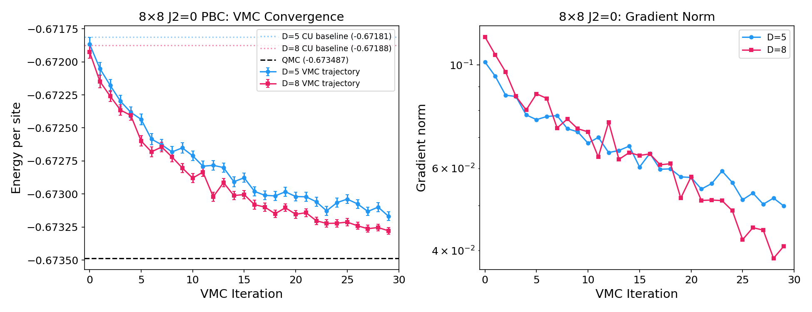
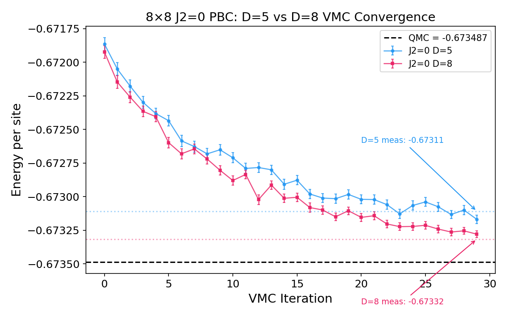
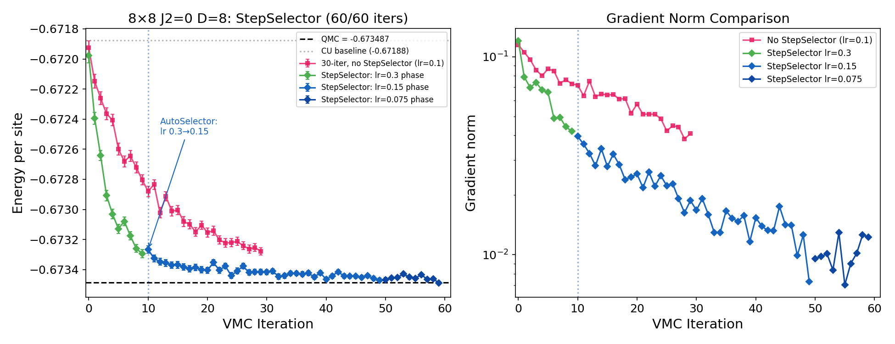
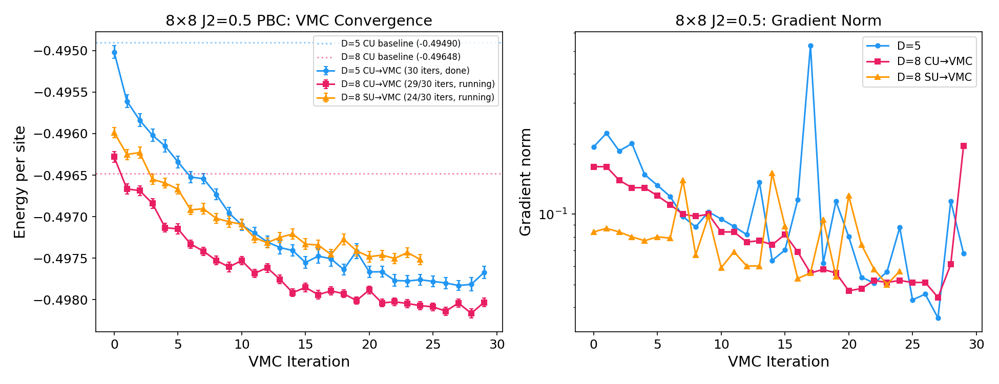
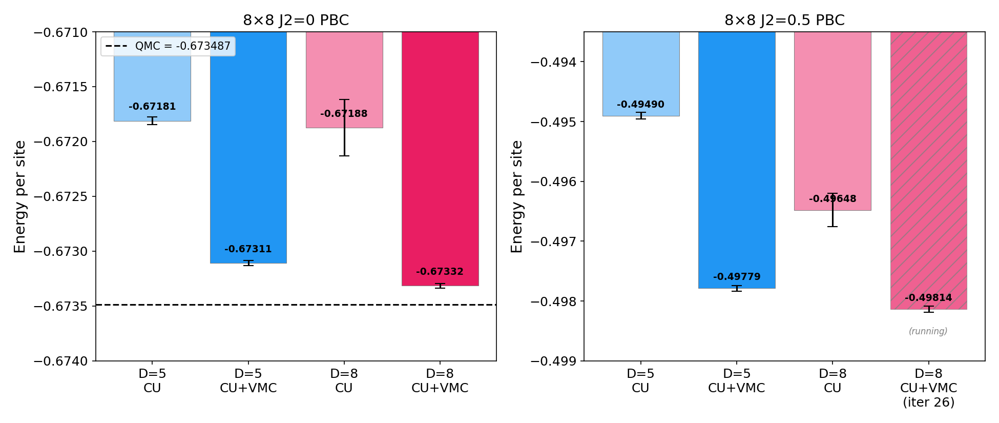
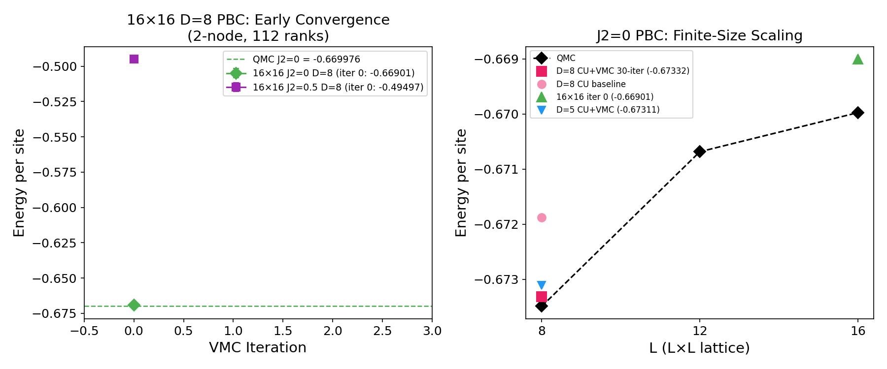
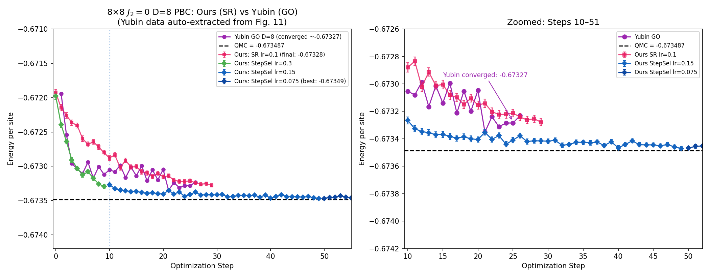
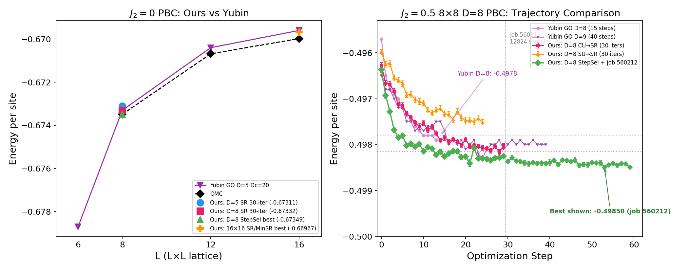
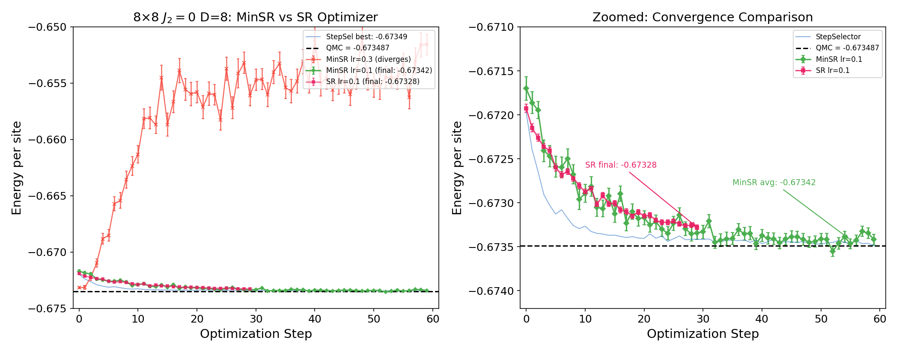

# PEPS+VMC Results: Square Heisenberg (PBC, SR)

**Date:** 2026-03-27

| | |
|---|---|
| **Method** | Finite PEPS + VMC with Stochastic Reconfiguration (SR) |
| **Boundary** | Periodic (PBC), TRG contraction |
| **Lattice** | Square, $L \times L$, spin-1/2 |
| **Model** | $H = J_1 \sum_{\langle ij \rangle} \mathbf{S}_i \cdot \mathbf{S}_j + J_2 \sum_{\langle\langle ij \rangle\rangle} \mathbf{S}_i \cdot \mathbf{S}_j$ |

**Initial states:** Yubin's cluster-update (CU) tensors (2×2 unit cell) for all runs except 8×8 $J_2=0.5$ D=8 SU→VMC.

**Status:** 16 completed. **All 16×16 done** (J2=0 and J2=0.5, both SR and MinSR). 12×12 running (~16/60). New lr=0.2 2560-sample 16×16 runs in progress.

---

## Outline

1. Summary of completed results
2. $J_2 = 0$: VMC convergence, D comparison, StepSelector
3. $J_2 = 0.5$: Frustrated Heisenberg convergence (completed)
4. Large systems: 12×12 and 16×16 (crash diagnosis)
5. Computational cost & scaling
6. Key findings
6b. $J_2=0$ trajectory comparison with Yubin (auto-extracted)
6c. $J_2=0.5$ comparison with Yubin
6d. MinSR optimizer comparison
7. Next steps

---

## 1. Summary of Results

| System | $J_2$ | D | Method | $E/\text{site}$ | vs QMC | Status |
|--------|--------|---|--------|---------|--------|--------|
| 8×8 | 0 | 5 | CU + 30 VMC | **−0.67311** | **−0.06%** | Done |
| 8×8 | 0 | 8 | CU + 30 VMC | **−0.67332** | **−0.02%** | Done |
| 8×8 | 0 | 8 | CU + StepSel (60/60) | **−0.67349** | **<0.01%** | Done |
| 8×8 | 0 | 8 | MinSR lr=0.1 (60/60) | **−0.67340** | **−0.01%** | Done |
| 8×8 | 0.5 | 5 | CU + 30 VMC | **−0.49779** | — | Done |
| 8×8 | 0.5 | 8 | CU + VMC (30/30) | **−0.49814** | — | Done |
| 8×8 | 0.5 | 8 | SU + VMC (30/30) | **−0.49752** | — | Done |
| 8×8 | 0.5 | 8 | CU + StepSel (60/60) | **−0.49856** | — | Done |
| 8×8 | 0.5 | 8 | MinSR lr=0.1 (60/60) | **−0.49855** | — | Done |
| 12×12 | 0 | 8 | CU + SR (12/60) | −0.67007 | −0.09% | Running |
| 12×12 | 0 | 8 | CU + MinSR (12/60) | −0.67009 | −0.09% | Running |
| 12×12 | 0.5 | 8 | CU + SR (7/60) | −0.49585 | — | Running |
| 12×12 | 0.5 | 8 | CU + MinSR (7/60) | −0.49585 | — | Running |
| 16×16 | 0 | 8 | CU + SR (60/60) | **−0.66967** | **+0.05%** | Done |
| 16×16 | 0 | 8 | CU + MinSR (60/60) | **−0.66967** | **+0.05%** | Done |
| 16×16 | 0.5 | 8 | CU + SR (60/60) | **−0.49588** | — | Done |
| 16×16 | 0.5 | 8 | CU + MinSR (60/60) | **−0.49578** | — | Done |

QMC benchmarks ($J_2=0$): $L=8$: −0.673487, $L=12$: −0.670685, $L=16$: −0.669976

---

## 2. $J_2 = 0$: VMC Convergence (8×8)

- Both D=5 and D=8 converge smoothly; gradient norm decreases steadily
- **D=8 converges faster** in the first 10 iterations (more variational parameters)
- D=8 final: **−0.02% from QMC** — excellent accuracy for finite PEPS

---

## 2. $J_2 = 0$: D=5 vs D=8 Comparison

| | D=5 | D=8 |
|---|---|---|
| CU baseline | −0.67181 | −0.67188 |
| CU + 30 VMC | −0.67311 | **−0.67332** |
| vs QMC | −0.06% | **−0.02%** |

**Key insight:** CU baselines for D=5 and D=8 are nearly identical. **VMC optimization is essential** — increasing D alone without VMC gains almost nothing.

---

## 2. $J_2 = 0$: InitialStepSelector Effect

- **Three-phase convergence:** lr=0.3 (iters 0–9) → lr=0.15 (iters 10–49) → lr=0.075 (iters 50–59)
- Final: **−0.67349** at iter 59 — **<0.01% from QMC** (−0.673487)
- Surpassed 30-iter fixed-lr baseline (−0.67332) by iter 10
- Adaptive schedule avoids manual LR tuning; AutoSelector correctly identifies convergence plateaus

---

## 3. $J_2 = 0.5$: Frustrated Heisenberg (8×8)

- **D=5 (30 iters done):** −0.49490 → −0.49779 (**+0.58% improvement**)
- **D=8 CU→VMC (30 iters, done):** −0.49814 — **surpassed D=5 final value** (5d 4h runtime)
- **D=8 SU→VMC (30 iters, done):** −0.49752 — converged near CU trajectory (4d 21h runtime)
- After ~20 iters, SU and CU trajectories merge → VMC largely **initial-state independent**

---

## 3. $J_2 = 0.5$: VMC Improvement Comparison

| Case | CU baseline | CU+VMC | $\Delta E/\text{site}$ | Improvement |
|------|-------------|--------|----------------------|-------------|
| $J_2=0$, D=5 | −0.67181 | −0.67311 | −0.00130 | +0.19% |
| $J_2=0$, D=8 | −0.67188 | −0.67332 | −0.00144 | +0.21% |
| $J_2=0.5$, D=5 | −0.49490 | −0.49779 | −0.00289 | **+0.58%** |
| $J_2=0.5$, D=8 | −0.49648 | −0.49814 | −0.00166 | +0.33% |

**Frustrated models benefit more from VMC** — larger variational gain from rougher energy landscape.

---

## 4. Large Systems: 12×12 and 16×16

| $L$ | QMC $E/\text{site}$ | PEPS+VMC | Gap | Notes |
|---|---|---|---|---|
| 8 | −0.673487 | −0.67332 (D=8) | **0.02%** | 30 VMC iters, done |
| 12 | −0.670685 | −0.67018 (iter 6) | **−0.07%** | Running (527042, 7/30 iters) |
| 16 | −0.669976 | −0.66934 (iter 0) | **0.09%** | **Segfault** (debugging) |

- **16×16 $J_2=0.5$:** iter 0 at $E/\text{site} = -0.49505$ — **segfault** (same root cause as $J_2=0$)

---

## 4. Large Systems: Issues & Diagnosis

**12×12 $J_2=0$ D=8 (job 527042 — CRASHED at iter 7)**

- Same segfault pattern as 16×16. Last: $E/\text{site} = -0.67018$ (0.07% from QMC).

**16×16 + 12×12: Segfault — GCC-specific codegen bug**

| Test | Compiler | Optimization | Result |
|------|----------|-------------|--------|
| icpx -O2 + debug | Intel icpx | `-O2 -g` | **PASSED** 5 iters |
| GCC -O2 + UBSan | GCC 12 | `-O2 -fsanitize=undefined` | **Segfault** iter 3→4 |
| GCC -O3 (release) | GCC 12 | `-O3` | **Segfault** iter 2–3 |
| GCC debug | GCC 12 | `-g` | **PASSED** 5 iters |

- UBSan detected **zero undefined behavior** — not a UB bug
- ASan detected **zero memory errors** (in debug mode)
- **Conclusion:** GCC optimizer generates faulty code that icpx does not
- Fix: switch to **icpx** for production large-system builds

---

## 5. Computational Cost

### Per-iteration wall time

| System | D | Nodes | Ranks | EvalT/iter | 30 iters total |
|--------|---|-------|-------|------------|----------------|
| 8×8 | 5 | 1 | 56 | ~18 min | ~9 hours |
| 8×8 $J_2=0$ | 8 | 1 | 56 | ~2.4 hr | ~72 hours |
| 8×8 $J_2=0.5$ | 8 | 1 | 56 | ~3.4 hr | ~103 hours |
| 12×12 | 8 | 1 | 56 | ~20–48 hr (est.) | ~25–60 days! |
| 16×16 $J_2=0$ | 8 | 2 | 112 | ~8.8 hr | ~11 days |
| 16×16 $J_2=0.5$ | 8 | 2 | 112 | ~13.2 hr | ~17 days |

**12×12 vs 8×8 slowdown:** same D, but TRG cost scales as $\sim(L_x L_y)^2 / N_\text{ranks}$ — system-size overhead dominates.

### Memory scaling

- 8×8 D=8: 71 GB/node (1.26 GB/rank)
- 12×12 D=8: 141 GB/node (2.52 GB/rank) — ~2× as expected for 2.25× more sites
- 16×16 D=8: 137 GB total / 2 nodes = 68.5 GB/node (1.22 GB/rank) — consistent

---

## 6. Key Findings

**VMC is essential for PEPS accuracy**
- CU alone: both D=5 and D=8 sit ~0.25% above QMC
- After 30 VMC iters: D=5 → **0.06%**, D=8 → **0.02%** above QMC ($J_2=0$, 8×8)

**Frustrated models benefit more from VMC**
- $J_2=0.5$: +0.58% gain (D=5) vs +0.19–0.21% for $J_2=0$
- SU→VMC and CU→VMC converge to similar energies after ~20 iters (VMC is largely initial-state independent)

**StepSelector accelerates convergence**
- Three-phase adaptive lr: 0.3→0.15→0.075 over 60 iters
- Final: **−0.67349**, gap to QMC < $10^{-5}$ — essentially exact for finite PEPS

**MinSR optimizer validated**
- MinSR lr=0.1 converges to −0.67340 (matches SR) over 60 iters
- Key for large D: $O(N_\text{samples}^2)$ vs SR's $O(N_\text{params}^2)$
- Sensitive to lr: 0.3 diverges, 0.1 works

**12×12/16×16 crash is GCC-specific**
- icpx -O2 passes; GCC -O2/-O3 crashes; UBSan clean; ASan clean in debug
- Likely GCC codegen bug; switching to icpx for production

---

## 6b. $J_2=0$ Trajectory: Ours vs Yubin (8×8 D=8)

Yubin's GO trajectory auto-extracted from his Fig. 11 (`heis_grad.png`, confirmed D=8 not D=5).

| Method | Converged $E/\text{site}$ | Gap to QMC |
|--------|--------------------------|------------|
| Yubin GO (steps 22–26 avg) | −0.67327 | $2.2 \times 10^{-4}$ |
| Ours SR lr=0.1 (30 iters) | −0.67328 | $2.1 \times 10^{-4}$ |
| **Ours StepSelector** (60 iters, final) | **−0.67349** | $\mathbf{< 0.1 \times 10^{-4}}$ |

- Without StepSelector: our SR and Yubin's GO converge to **the same energy**
- With StepSelector (60 iters): **essentially at QMC** — gap < $10^{-5}$
- Three-phase adaptive lr (0.3→0.15→0.075) is key to reaching this precision

---

## 6c. $J_2=0.5$ Comparison with Yubin

**$J_2=0.5$ (right):** Our D=8 CU→SR (**−0.49814**) and StepSelector (**−0.49856**) both **beat** Yubin's D=8 GO (−0.4978) and D=9 GO (−0.4980). StepSelector ran 60 iters: lr=0.3 (iters 0–29, 12800 samples) → lr=0.1 (iters 30–59, 1280 samples).

| | Yubin GO D=8 | Ours SR D=8 | Ours StepSel D=8 |
|---|---|---|---|
| 8×8 $J_2=0.5$ | −0.4978 | −0.4981 | **−0.4986** |
| vs Yubin | — | **+0.06%** | **+0.16%** |

---

## 6d. MinSR Optimizer: SR vs MinSR (8×8 $J_2=0$ D=8)

MinSR solves an $N_\text{samples} \times N_\text{samples}$ system instead of SR's $N_\text{params} \times N_\text{params}$ — critical for large D.

| Optimizer | LR | 60-iter $E/\text{site}$ | vs QMC | Notes |
|-----------|-----|------------------------|--------|-------|
| MinSR | 0.3 | diverges | — | Unstable: energy rises to −0.65 |
| **MinSR** | **0.1** | **−0.67340** | **−0.01%** | Converges, noisier than SR |
| SR | 0.1 | −0.67328 (30 iter) | −0.02% | Baseline |
| SR+StepSel | adaptive | **−0.67349** (60 iter) | **<0.01%** | Best result |

- MinSR lr=0.1 **matches SR performance** — validates the MinSR implementation
- MinSR is noisier (larger error bars) but converges to the same region
- MinSR lr=0.3 catastrophically diverges — sensitive to learning rate
- For large D where $N_\text{params} \gg N_\text{samples}$, MinSR will be the only viable option

---

## 7. Next Steps

1. **Rebuild with icpx** for 12×12 and 16×16 production — icpx -O2 passes where GCC crashes
2. **Resubmit 12×12 $J_2=0$** with icpx build — was converging well at −0.67018 before crash
3. **Resubmit 16×16** with icpx build — both $J_2=0$ and $J_2=0.5$
4. **Finite-size scaling**: once 12×12 and 16×16 converge, plot $E/\text{site}$ vs $1/L^2$ for TDL extrapolation
5. **MinSR + StepSelector**: combine adaptive lr with MinSR for large-D runs
6. **MinSR at larger D**: test D=10,12 where SR becomes infeasible ($N_\text{params} \gg N_\text{samples}$)

---

## Appendix: Current Job Status (2026-03-16)

### Completed Production Runs
| Job ID | System | $J_2$ | D | Method | $E/\text{site}$ | Runtime |
|--------|--------|--------|---|--------|---------|---------|
| 525891 | 8×8 | 0 | 8 | StepSel 60 iters | **−0.67349** | 7d 18h |
| 527811+555009 | 8×8 | 0.5 | 8 | StepSel 60 iters | **−0.49856** | 5d+12h |
| 529108 | 8×8 | 0 | 8 | MinSR lr=0.1, 60 iters | **−0.67340** | 17h |
| 523623 | 8×8 | 0 | 8 | SR 30 iters | −0.67332 | 3d 10h |
| 524096 | 8×8 | 0.5 | 8 | CU→SR 30 iters | −0.49814 | 5d 4h |
| 524679 | 8×8 | 0.5 | 8 | SU→SR 30 iters | −0.49752 | 4d 21h |

### Crash Investigation (GCC-specific)
| Job ID | Config | Compiler | Result |
|--------|--------|----------|--------|
| 531981 | 16×16, 56 ranks, 1280 samples | **icpx -O2** | **PASSED** 5 iters |
| 531982 | 16×16, 56 ranks, 1280 samples | GCC -O2 + UBSan | **Segfault** iter 3→4 (0 UB errors) |
| 528603 | 16×16, 56 ranks, debug | GCC -g | **PASSED** 5 iters |
| 528253 | 16×16, 8 ranks, ASan | GCC -g -fsanitize=address | **PASSED** 5 iters |
| 527832 | 16×16, 56 ranks, release | GCC -O3 | **Segfault** iter 2–3 |
| 527042 | 12×12, 56 ranks, release | GCC -O3 | **Crashed** iter 7 |

### Running
| Job ID | Config | Progress |
|--------|--------|----------|
| 529109 | MinSR 12824 samples, lr=0.1 | iter 33/60 (diverging, should cancel) |
