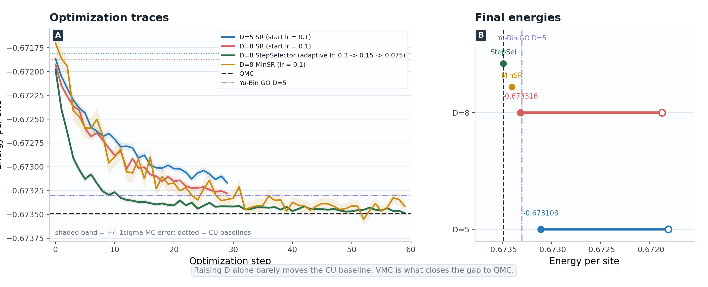
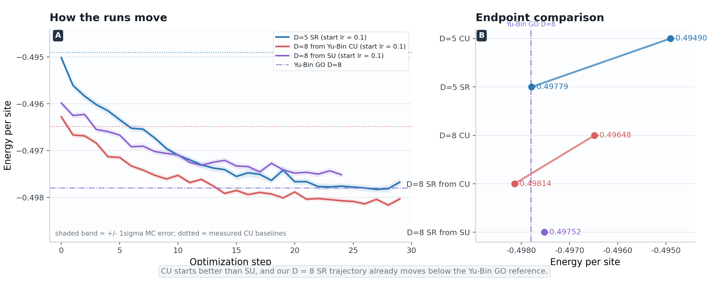
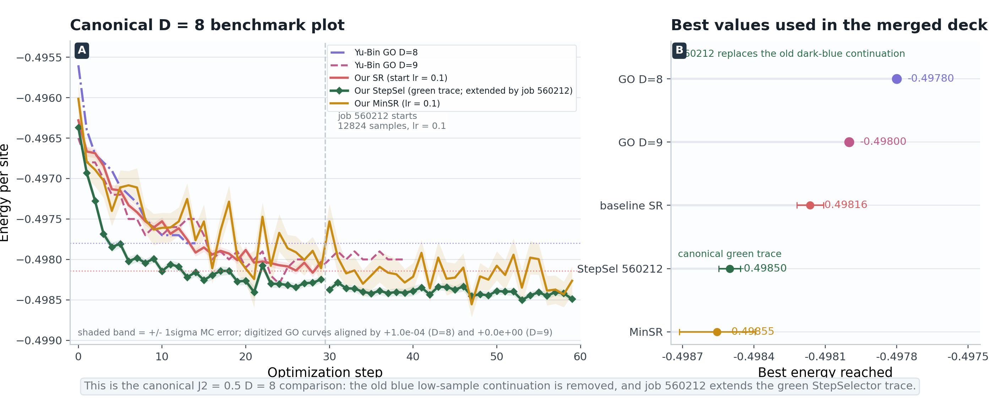
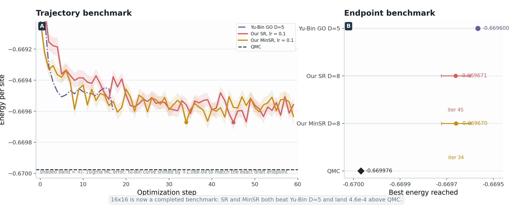

<!-- _class: title -->

# PBC PEPS+VMC
## Unified `0325` Version

Square Heisenberg, PBC, TRG contraction  
2026-03-25

  

    
Absorbed from 2026-03-21

    
8×8 physics picture

    
`J2=0` and `J2=0.5` conclusions remain the stable core of the story.

  

  

    
Added on 2026-03-25

    
16×16 benchmark

    
SR and MinSR now both finish `60/60` and tie at <strong>-0.66967</strong>.

  

  

    
Canonical deck rule

    
Only maintain `0325`.

    
This is the single version to keep updating.

  

  <strong>Figure cleanup in this merge:</strong> the canonical `J2=0.5` StepSelector comparison now uses job `560212` as the continuation of the green trace; the old dark-blue continuation is removed.

---

<!-- _class: figure-slide -->

## 8×8, J2 = 0
### One page is enough: baseline SR, adaptive-lr `StepSelector`, `MinSR`, Yu-Bin GO, and QMC already tell the whole story

<strong>Read this page in one sentence:</strong> the `CU` baselines at `D=5` and `D=8` are almost the same, while VMC closes the gap to QMC; `StepSelector` is the adaptive-lr version of the same SR story, and `MinSR` lands in the same low-energy window.

---

<!-- _class: figure-slide -->

## 8×8, J2 = 0.5
### Page 1 asks only about bond dimension and starting tensor: `D=5` vs `D=8`, `CU` vs `SU`, with Yu-Bin GO as reference

<strong>Answer:</strong> `CU` starts lower than `SU`, `D=8` finishes lower than `D=5`, and the frustrated case gains more from VMC than `J2=0`.

---

<!-- _class: figure-slide -->

## 8×8, J2 = 0.5
### Canonical `D = 8` benchmark page: baseline SR, higher-sample `StepSelector`, `MinSR`, and Yu-Bin GO in one plot

<strong>Read this page in one sentence:</strong> fixed-lr SR already beats Yu-Bin `GO D=8`, `MinSR` stays slightly lower still, and the canonical StepSelector trace is now the green line extended by job `560212`, not the old dark-blue low-sample continuation.

---

<!-- _class: figure-slide -->

## 16×16, J2 = 0
### Benchmark page: completed SR and MinSR runs against Yu-Bin GO `D=5` and the QMC reference

<strong>Read this page in one sentence:</strong> SR and MinSR finish the full `60/60` iterations at the same best energy `-0.66967`, beat the Yu-Bin benchmark `-0.6696`, and sit only `4.6e-4` above QMC.

---

<!-- _class: dark -->

## Bottom Line

  

    
J2 = 0

    
The 8×8 conclusion did not change.

    
VMC matters much more than increasing `D` alone, and `D=8` is already close to QMC.

  

  

    
J2 = 0.5

    
Use the merged benchmark figure.

    
Job `560212` now carries the canonical StepSelector continuation in the `D=8` comparison.

  

  

    
16×16 benchmark

    
Now complete, not provisional.

    
SR and MinSR both finish `60/60` and tie at <strong>-0.66967</strong>.

  

  

    
Caveat

    
These are still trace-level best values.

    
The optimizer benchmark story is clear, but standalone remeasurement of the best states is still useful.

  

This `0325` deck is the merged canonical version.

