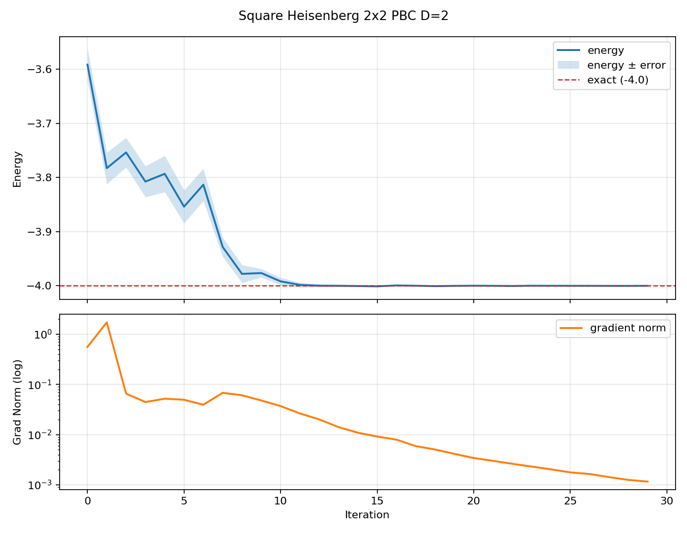
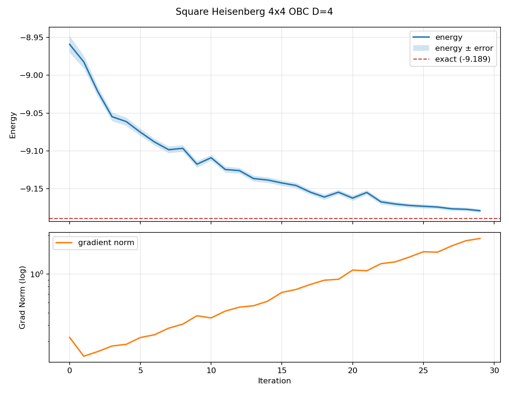

## Quick Start: Simulating the Heisenberg Model with PEPS VMC

This tutorial walks through a complete PEPS variational Monte Carlo simulation
of the spin-1/2 antiferromagnetic Heisenberg model on a square lattice:

$$H = J \sum_{\langle i,j \rangle} \mathbf{S}_i \cdot \mathbf{S}_j, \quad J = 1$$

We assume you are familiar with the PEPS ansatz and the idea of variational
optimization. The goal here is to get a working simulation end-to-end and
understand what the code produces at each stage.

The simulation proceeds in three physically distinct steps:

| Step | Binary | What it does                                                                                                                                                                          |
|------|--------|---------------------------------------------------------------------------------------------------------------------------------------------------------------------------------------|
| 1. Simple Update | `simple_update` | Initialize the PEPS via imaginary-time evolution. This gives a good starting wavefunction by projecting toward the ground state using local (Trotter-decomposed) gates.               |
| 2. VMC Optimize | `vmc_optimize` | Variationally optimize all PEPS tensor elements to minimize the energy `<H>`. In this tutorial, we uses Stochastic Reconfiguration (SR) with Monte Carlo sampling.                    |
| 3. MC Measure | `mc_measure` | With the optimized PEPS fixed, collect high-statistics Monte Carlo samples to measure physical observables: energy, local magnetization `<Sz>`, bond energies, and spin correlations. |

---

### Prerequisites

Build the three binaries following the instructions in the project README:

```bash
mkdir -p build && cd build
cmake .. && make -j4
```

Verify they exist:

```bash
ls build/simple_update build/vmc_optimize build/mc_measure
```

If your binaries are in a different directory (e.g. `debug/`), substitute
accordingly in all commands below.

---

### 1) Laptop Example: 2x2 Square Lattice with PBC

This small system runs in a few seconds on any laptop. Despite its size, it
exercises the full pipeline and produces the same output structure as production
runs on larger systems.

**Physics setup** (`params/quickstart/physics_local_2x2_pbc.json`):

```json
{
  "CaseParams": {
    "Lx": 2, "Ly": 2,
    "J2": 0.0,
    "ModelType": "SquareHeisenberg",
    "BoundaryCondition": "Periodic"
  }
}
```

This defines a 2x2 square lattice with periodic boundary conditions (PBC) and
nearest-neighbor coupling only (J2=0). PBC means the lattice wraps around in
both directions, so every site has 4 nearest neighbors. For a 2x2 PBC lattice
there are 8 bonds total (4 horizontal + 4 vertical, counting the periodic wraps).

#### Step 1: Simple Update -- initialize the PEPS

The simple update performs imaginary-time evolution
`|psi> ~ exp(-tau*H)|psi_init>` using Trotter-decomposed local gates. Each
"step" applies one full sweep of gates across all bonds and truncates bond
dimensions via SVD. The singular values (lambda tensors) on each bond converge
as the state approaches the ground state.

**Algorithm params** (`params/quickstart/simple_update_local_2x2_pbc.json`):

```json
{
  "CaseParams": {
    "Dmin": 2, "Dmax": 2,
    "Tau": 0.2,
    "Step": 8
  }
}
```

- `Dmax=2`: bond dimension of the PEPS (small for this toy system)
- `Tau=0.2`: Trotter step size
- `Step=8`: number of imaginary-time sweeps

**Run it:**

```bash
./build/simple_update params/quickstart/physics_local_2x2_pbc.json \
                      params/quickstart/simple_update_local_2x2_pbc.json
```

**What you should see** (abbreviated):

```
=====> SIMPLE UPDATE PROGRAM FOR Square-Lattice PEPS <=====
                 System size (lx, ly) : (2, 2)
     SquareLatticePEPS bond dimension : 2/2
                         Trotter step : 0.2

step = 0  lambda tensors in middle :
[ 9.9507e-01 9.9177e-02 ]
Estimated E0 =    -2.69205241  ...  Dmin/Dmax =  2/2  TruncErr = 0.00e+00
step = 1  ...
Estimated E0 =    -2.87856911  ...  TruncErr = 2.54e-05
...
step = 7  ...
Estimated E0 =    -2.86524276  ...  TruncErr = 3.97e-04

Simple Update completed.
SplitIndexTPS saved to: tpsfinal
```

The key outputs:
- **Lambda tensors**: singular values on each bond. They should converge across
  steps, indicating the PEPS is settling into a stable state.
- **Estimated E0**: a rough energy estimate from the local tensors (not the
  true variational energy -- that will be given by Monte-Carlo).
- **Directories created**: `tpsfinal/` (TPS format for VMC) and
  `peps/` (raw PEPS tensors with lambda tensors).

#### Step 2: VMC Optimization -- minimize the energy

Starting from the simple-update PEPS, the VMC optimizer treats all tensor
elements as variational parameters and updates them to minimize the energy.
At each iteration it:

1. Draws Monte Carlo samples of spin configurations from `|psi|^2`
2. Computes the local energy `E_loc(x) = <x|H|psi>/<x|psi>` for each sample
3. Computes the energy gradient with respect to tensor parameters
4. Updates parameters using Stochastic Reconfiguration (SR), which
   preconditions the gradient with the quantum Fisher information matrix

PBC systems use the Tensor Renormalization Group (TRG) to contract the
environment, controlled by `TRGDmin/TRGDmax` parameters.

**Algorithm params** (`params/quickstart/vmc_local_2x2_pbc_n1.json`):

```json
{
  "CaseParams": {
    "TRGDmin": 2, "TRGDmax": 4,
    "MC_total_samples": 1000,
    "WarmUp": 20,
    "OptimizerType": "SR",
    "MaxIterations": 30,
    "LearningRate": 0.05,
    "CGMaxIter": 20, "CGTol": 1e-6, "CGDiagShift": 1e-4
  }
}
```

- `MC_total_samples=1000`: number of MC samples per iteration
- `MaxIterations=30`: optimization steps
- `LearningRate=0.05`: SR step size
- `CGMaxIter/CGTol/CGDiagShift`: conjugate gradient solver for the SR linear system

**Run it** (single process for PBC):

```bash
./build/vmc_optimize params/quickstart/physics_local_2x2_pbc.json \
                     params/quickstart/vmc_local_2x2_pbc_n1.json
```

**What you should see** (showing selected iterations):

```
=== VMC Optimization ===
Optimizer: StochasticReconfiguration
Learning Rate: 0.05
Max Iterations: 30
=================================
Loading SplitIndexTPS from: tpsfinal
✓ Configuration validation: All 1 processes have valid configurations.

=====> VMC PEPS OPTIMIZER EXECUTOR <=====
System size (lx, ly):                   (2, 2)
Boundary condition:                     Periodic
PEPS bond dimension:                    2
TRG bond dimension:                     2/4
Total samples:                          1000
...

Iter 0   LR = 5.0e-02  E0 = -3.591763  ± 2.98e-02  Grad norm = 5.6e-01  Accept rate = [0.26 ]
Iter 5   LR = 5.0e-02  E0 = -3.853844  ± 3.05e-02  Grad norm = 5.0e-02  ...
Iter 10  LR = 5.0e-02  E0 = -3.991783  ± 6.76e-03  Grad norm = 3.7e-02  ...
Iter 15  LR = 5.0e-02  E0 = -4.000983  ± 1.20e-03  Grad norm = 9.2e-03  ...
Iter 20  LR = 5.0e-02  E0 = -3.999846  ± 2.72e-04  Grad norm = 3.4e-03  ...
Iter 29  LR = 5.0e-02  E0 = -3.999994  ± 8.96e-05  Grad norm = 1.2e-03  ...

Optimization completed!
```

**Reading the iteration output:**

```
Iter 29  LR = 5.0e-02  E0 = -3.999994  ± 8.96e-05  Grad norm = 1.2e-03  Accept rate = [0.33 ]
 │        │              │      │              │                 │
 │        │              │      │              │                 └─ MC acceptance rate (~0.3-0.5 is healthy)
 │        │              │      │              └─ gradient norm (should decrease as you converge)
 │        │              │      └─ MC standard error on the energy
 │        │              └─ variational energy estimate (total, not per site)
 │        └─ current learning rate
 └─ iteration number
```

The energy starts around -3.6 and converges to -4.0000 by iteration ~13, with
error bars shrinking from 0.03 to 0.0001 and gradient norm dropping by 3 orders
of magnitude. For a 2x2 PBC Heisenberg lattice (8 bonds), the exact
ground-state energy is -4.0 (i.e. -0.5 per bond, an undergraduate exercise).
Our result `-4.0000 ± 0.0001` matches the exact value to 4 decimal places,
demonstrating that a D=2 PEPS exactly represents this small system's ground state.

**Key outputs:**
- `tpsfinal/`: updated PEPS tensors (overwritten at the end of the VMC) and final configurations which can be used as warmed up configuration in the following MC calculations.
- `tpslowest/`: snapshot of the PEPS at the lowest energy seen
- `energy/energy_trajectory.csv`: iteration-by-iteration energy log

#### Step 3: MC Measurement -- compute observables

With the optimized PEPS fixed, this step draws fresh MC samples (no parameter
updates) and measures physical observables: total energy, site-resolved
magnetization `<Sz>`, and bond energies `<S_i . S_j>` on every bond.

**Algorithm params** (`params/quickstart/measure_local_2x2_pbc_n1.json`):

```json
{
  "CaseParams": {
    "TRGDmin": 2, "TRGDmax": 4,
    "MC_total_samples": 2000,
    "WarmUp": 20
  }
}
```

The measurement uses more samples (`2000` vs `1000` during optimization) to reduce
statistical error on the final observables.

**Run it:**

```bash
./build/mc_measure params/quickstart/physics_local_2x2_pbc.json \
                   params/quickstart/measure_local_2x2_pbc_n1.json
```

**What you should see:**

```
=====> MONTE-CARLO MEASUREMENT PROGRAM FOR PEPS <=====
System size (lx, ly):                   (2, 2)
Boundary condition:                     Periodic
...
Total samples:                          2000
...
[=======>               ] 10 %
...
[========================] 100 %
Accept rate = [0.33 ]Rank 0: statistic data finished.
```

---

### 2) Examining the Results

After all three steps complete, the working directory contains:

```
tpsfinal/          # Optimized PEPS tensors (SplitIndexTPS format)
tpslowest/         # Best-energy snapshot during VMC
peps/              # Raw PEPS from simple update (gamma + lambda tensors)
energy/
  energy_trajectory.csv   # Per-iteration energy during VMC
stats/
  energy.csv              # Final MC energy estimate ± stderr
  spin_z_mean.csv         # <Sz> at each lattice site
  spin_z_stderr.csv       # Standard error of <Sz>
  bond_energy_h_mean.csv  # Horizontal bond energies <S_i . S_j>
  bond_energy_h_stderr.csv
  bond_energy_v_mean.csv  # Vertical bond energies
  bond_energy_v_stderr.csv
samples/
  psi.csv                 # Raw wavefunction amplitude samples
```

#### Total energy (`stats/energy.csv`)

```csv
index,mean,stderr
0,-4.00089439296227045e+00,0.00000000000000000e+00
```

The total ground-state energy estimate is **E = -4.001**, matching the exact
value of -4.0 (i.e. -0.5 per bond on 8 bonds) to three decimal places.

> **Note on stderr = 0:** The standard error is computed across MPI ranks as
> independent bins. With a single-rank run, there is only one bin, so stderr = 0
> by construction. This does not mean the estimate is exact -- it means the
> single-rank error estimation has no cross-bin variance to measure. To obtain
> a nonzero stderr, use at least 2 MPI ranks (see the 4x4 OBC example, which
> uses 16 ranks and reports stderr = 0.0027).

#### Magnetization (`stats/spin_z_mean.csv`)

```
-0.0175,  0.0260
-0.0035, -0.0050
```

This is a 2x2 matrix of `<Sz>` values on each site (rows = y, columns = x).
All values are close to zero (< 0.03), as expected for the ground state of
the isotropic Heisenberg model. The exact ground state has `<Sz> = 0` on every
site due to SU(2) symmetry. The small residuals are finite-statistics
fluctuations that decrease with more MC samples.

#### Bond energies (`stats/bond_energy_h_mean.csv` and `bond_energy_v_mean.csv`)

Horizontal bonds (2x2 matrix for PBC, including periodic wraps):

```
-0.5078, -0.5078
-0.5080, -0.5080
```

Vertical bonds:

```
-0.4924, -0.4923
-0.4924, -0.4923
```

Each entry is the expectation value `<S_i . S_j>` on one bond.
For the Heisenberg AFM, bond energies are negative (antiferromagnetic
correlations). The exact value for each bond in the ground state is -0.5
(for the singlet). Our values are all within 0.01 of the exact value.

The total energy equals the sum of all bond energies:
`E_total = sum(bond_energy_h) + sum(bond_energy_v) = (-2.032) + (-1.969) = -4.001`,
which matches `stats/energy.csv`.

#### Energy convergence plot

The VMC energy trajectory shows how the variational energy decreases during
optimization:



The upper panel shows the energy with error bars converging from ~-3.6 toward
the exact value -4.0 (red dashed line). The lower panel shows the gradient norm
decreasing, indicating the optimizer is approaching a minimum.

**To generate this plot yourself:**

```bash
python3 plot/workflow/plot_energy_trajectory.py \
  --csv energy/energy_trajectory.csv \
  --out energy/energy_trajectory.png \
  --title "Square Heisenberg 2x2 PBC D=2" \
  --ref-energy -4.0 --ref-label "exact"
```

The plotting script reads `energy_trajectory.csv` (columns: `iteration`,
`energy`, `energy_error`, `gradient_norm`) and produces a two-panel figure.
Use `--ref-energy` to add a horizontal reference line (e.g. the exact solution).
Requires `matplotlib`.

---

### 3) Automated Workflow Script

The `scripts/run_quickstart_workflow.sh` script runs all three steps plus
plotting in one command, and organizes outputs into a timestamped run directory
under `run/`:

```bash
scripts/run_quickstart_workflow.sh --profile local22_pbc --build-dir build
```

This creates a directory like `run/20260215_120000_local22_pbc/` containing:

```
run/20260215_120000_local22_pbc/
  01_simple_update.log    # Full log from step 1
  02_vmc.log              # Full log from step 2
  03_measure.log          # Full log from step 3
  04_plot.log             # Plotting script output
  params_used/            # Snapshot of all param files used
  energy/                 # energy_trajectory.csv + .png
  stats/                  # All measurement CSV files
  samples/                # Raw MC samples
  tpsfinal/               # Final optimized PEPS
  tpslowest/              # Best-energy snapshot
  peps/                   # Simple-update PEPS
  run_info.txt            # Metadata: host, git commit, params
  checkpoints_and_artifacts.txt
  files_manifest.txt
  status.txt              # SUCCESS or FAILED
```

To verify a run completed successfully:

```bash
RUN_DIR="$(ls -td run/*local22_pbc* | head -n 1)"
cat "$RUN_DIR/status.txt"
# Expected: SUCCESS end_time=2026-02-15 12:00:00

cat "$RUN_DIR/stats/energy.csv"
# Expected: index,mean,stderr
#           0,-4.00...,0.00...
```

**Important:** On some systems, the tiny 2x2 OBC configuration can crash
during warm-up. Use **2x2 PBC** for local smoke tests.

---

### 4) Scaling Up: 4x4 OBC on a Cluster

For a physically more interesting system, here is a 4x4 square lattice with
open boundary conditions (OBC), using 16 MPI ranks and bond dimension D=4.
This is representative of a production-scale setup (though still small by
research standards).

The measurement data from this run is archived in `tutorials/data/4x4_obc_d4/`
(stats CSVs, energy trajectory, and parameter snapshots).

#### Physics and algorithm parameters

**Physics** (`params/quickstart/physics_cluster_4x4_obc.json`):
- 4x4 square lattice, OBC, J1=1, J2=0

**Simple update** (`params/quickstart/simple_update_cluster_4x4_obc.json`):
- D=4, Tau=0.2, 100 imaginary-time steps

**VMC** (`params/quickstart/vmc_cluster_4x4_obc_n16.json`):
- D_bmps=4/8 (BMPS contraction for OBC), 3200 MC samples, 30 SR iterations,
  LR=0.1, 16 MPI ranks

Note that OBC uses BMPS (Boundary MPS) contraction instead of TRG. The BMPS
bond dimension `Dbmps_max` controls the accuracy of the environment
approximation.

#### Running on a cluster

```bash
# From the repo root
scripts/run_quickstart_workflow.sh \
  --profile cluster44_obc \
  --build-dir build \
  --mpi-ranks 16 \
  --tag slurm_job_${SLURM_JOB_ID:-manual}
```

Or step-by-step:

```bash
./build/simple_update params/quickstart/physics_cluster_4x4_obc.json \
                      params/quickstart/simple_update_cluster_4x4_obc.json

mpirun -n 16 ./build/vmc_optimize params/quickstart/physics_cluster_4x4_obc.json \
                                  params/quickstart/vmc_cluster_4x4_obc_n16.json

mpirun -n 16 ./build/mc_measure params/quickstart/physics_cluster_4x4_obc.json \
                                params/quickstart/measure_cluster_4x4_obc_n16.json
```

#### VMC convergence (from the archived run)

The energy decreases from -8.96 to -9.18 over 30 iterations:

```
Iter 0   E0 = -8.959130  ± 1.11e-02  Grad norm = 3.2e-01
Iter 5   E0 = -9.075293  ± 4.84e-03  Grad norm = 3.2e-01
Iter 10  E0 = -9.109045  ± 3.78e-03  Grad norm = 4.6e-01
Iter 15  E0 = -9.142430  ± 3.72e-03  Grad norm = 7.2e-01
Iter 20  E0 = -9.162394  ± 3.46e-03  Grad norm = 1.1e+00
Iter 25  E0 = -9.173246  ± 2.77e-03  Grad norm = 1.5e+00
Iter 29  E0 = -9.179111  ± 2.42e-03  Grad norm = 1.9e+00
```

The best energy in this run was **E = -9.1791** at iteration 29. For a 4x4 OBC
lattice with 24 bonds, this is -0.383 per bond. The exact ground-state energy
for this system is -9.189 (reachable with larger D or more iterations).



#### Final measurement results (from the archived run)

**Total energy** (`stats/energy.csv`):

```csv
index,mean,stderr
0,-9.17710625071013020e+00,2.36928280746151075e-03
```

**E = -9.1771 +/- 0.0024** -- consistent with the best VMC iteration and
with reduced error bar from higher-statistics measurement sampling. This is
within 0.012 of the exact value -9.189.

**Magnetization** (`stats/spin_z_mean.csv`): a 4x4 matrix showing the
antiferromagnetic pattern:

```
-0.0813,  0.0891, -0.0797,  0.0734
 0.0694, -0.0828,  0.0759, -0.0741
-0.0750,  0.0819, -0.0700,  0.0709
 0.0784, -0.0788,  0.0694, -0.0669
```

The alternating-sign checkerboard pattern is the hallmark of Neel
antiferromagnetic correlations. The magnitudes (~0.07-0.09) are reduced from
the classical value (0.5) by quantum fluctuations, consistent with the known
strong quantum corrections in the 2D Heisenberg model.

**Horizontal bond energies** (`stats/bond_energy_h_mean.csv`): a 4x3 matrix
(4 rows, 3 columns because OBC has `Lx-1 = 3` horizontal bonds per row):

```
-0.4544, -0.3043, -0.4577
-0.3735, -0.2927, -0.3769
-0.3824, -0.2985, -0.3771
-0.4668, -0.3041, -0.4691
```

**Vertical bond energies** (`stats/bond_energy_v_mean.csv`): a 3x4 matrix
(`Ly-1 = 3` vertical bonds per column):

```
-0.4695, -0.3922, -0.3862, -0.4644
-0.3085, -0.2994, -0.3143, -0.3135
-0.4637, -0.3759, -0.3695, -0.4625
```

Edge bonds (first/last row and column) have larger magnitudes (~0.45-0.47)
than interior bonds (~0.29-0.32), because boundary spins have fewer neighbors
and form stronger correlations with their available partners. This is a
well-known OBC finite-size effect.

#### Additional observables (4x4 OBC only)

The OBC model also registers spin-spin correlation observables:

| File | Meaning |
|------|---------|
| `stats/SzSz_all2all.csv` | All-pair `<Sz_i Sz_j>` correlations (packed upper-triangular) |
| `stats/SmSp_row.csv` | Middle-row `<S-_i S+_j>` correlations |
| `stats/SpSm_row.csv` | Middle-row `<S+_i S-_j>` correlations |

These are absent from the PBC run because the PBC backend does not register
them (not an error).

---

### 5) Output File Reference

#### `stats/` CSV formats

There are two CSV formats in `stats/`:

1. **Flat format** (header: `index,mean,stderr`): for scalar or 1D observables,
   e.g. `energy.csv`, `SzSz_all2all.csv`
2. **Matrix format** (no header, comma-separated values): for lattice-shaped
   observables, e.g. `spin_z_mean.csv`, `bond_energy_h_mean.csv`

Matrix shape conventions for the square Heisenberg model:

| Observable | OBC shape | PBC shape |
|------------|-----------|-----------|
| `spin_z_*` | Ly x Lx | Ly x Lx |
| `bond_energy_h_*` | Ly x (Lx-1) | Ly x Lx |
| `bond_energy_v_*` | (Ly-1) x Lx | Ly x Lx |

PBC matrices include the periodic wrap-around bonds, hence the full Ly x Lx shape.

#### `energy/energy_trajectory.csv`

Columns: `iteration`, `energy`, `energy_error`, `gradient_norm`

This file is written by the VMC optimizer and records the variational energy
at each iteration. Use it to diagnose convergence. The plotting script
`plot/workflow/plot_energy_trajectory.py` visualizes it:

```bash
python3 plot/workflow/plot_energy_trajectory.py \
  --csv energy/energy_trajectory.csv \
  --out energy/energy_trajectory.png
```

#### Directory layout

| Directory | Contents | When created |
|-----------|----------|-------------|
| `peps/` | Raw PEPS: `gamma_ten_*.qlten` (site tensors) + `lam_*.qlten` (bond singular values) | Simple update |
| `tpsfinal/` | SplitIndexTPS: `tps_ten*_*.qlten` + MC configurations + metadata | Simple update, updated by VMC and measurement |
| `tpslowest/` | Snapshot of tpsfinal at the lowest energy seen during VMC | VMC (if energy improved) |
| `energy/` | `energy_trajectory.csv` + optional `.png` | VMC |
| `stats/` | Measurement CSV files | Measurement |
| `samples/` | `psi.csv` — raw wavefunction amplitudes | Measurement |

---

### 6) Improving Energy After Quick Start

The quick-start parameters are deliberately small for speed. To approach
publication-quality results:

1. **Increase PEPS bond dimension** (`Dmax` in simple update). D=4 is a
   minimum for research; D=6-8 captures more entanglement.

2. **Increase environment bond dimension** (OBC: `Dbmps_max`; PBC:
   `TRGDmax`). Should be at least `D^2` for accurate contraction.

3. **Increase MC statistics** (`MC_total_samples`). More samples reduce the
   energy error bar. Use at least 10,000-50,000 for production.

4. **Increase optimization iterations** (`MaxIterations`). Continue until the
   energy plateaus and the gradient norm stabilizes.

5. **Resume from checkpoint**: the `tpsfinal/` directory is the checkpoint.
   Re-running VMC or measurement with the same `ConfigurationLoadDir` resumes
   from the saved state.

For parameter details, see `tutorials/04-parameter-reference.md`.
For failure diagnosis, see `tutorials/05-troubleshooting.md`.
